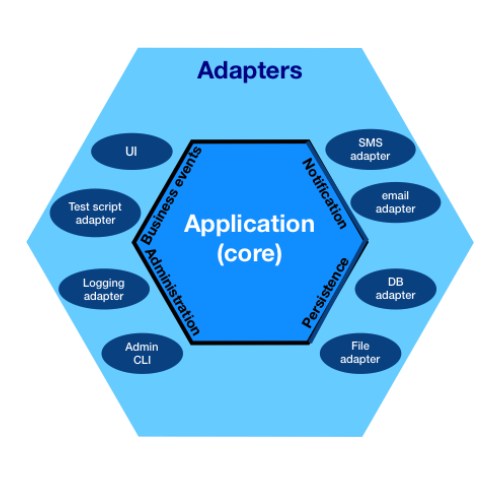

# Hexagonal Architecture

# Hexagonal Architecture 란?

Ports & Adapter Architecture 라고도 할 수 있으며, 비즈니스 핵심 domain model 을 외부 환경에 의존하지 않도록 하는 것이 핵심이다. Interface 인 port 와 그 구현체인 adapter 로 domain 에 접근 할 수 있게 함으로 결합도를 낮출수 있고, 결합도가 낮음으로 인해 단위테스트 또한 간편해진다는 장점이 있다. 또한 비즈니스의 핵심 로직을 수정하지 않고서 외부 infra, interface 등이 변경할 수 있다는 장점 또한 존재한다.

# Domain

Hexagonal Architecture 에서 가장 중심에 존재하는 core 로 핵심 비즈니스 로직, 모델 등이 존재하게 된다. Domain 에서는 외부에 대한 의존성이 존재하여서는 안되며, 이는 외부환경이 변경되더라도 domain 의 변경이 있어서는 안된다는 것을 의미한다.

# Port

Port 는 외부와 domain 을 이어주는 interface 로 외부에서 domain 에 접근하기 위한 Input port, domain 에서 외부로 나가는 output port 두 종류가 있다.

# Adapter

Adapter 는 port 의 구현체로 요구사항등에 의해 infra 가 변경될 시 그에 따라 변경 될 수 있다. 예를 들어 HTTP 통신을 사용하여 API 를 제공하다 RPC 로의 변경이 필요하다면 Adapter 를 새로 만들거나 수정하여 목적을 달성할 수 있으며, domain 의 변경은 불필요하게 된다.

# Reference

[https://engineering.linecorp.com/ko/blog/port-and-adapter-architecture/](https://engineering.linecorp.com/ko/blog/port-and-adapter-architecture/)

[https://alistair.cockburn.us/hexagonal-architecture/](https://alistair.cockburn.us/hexagonal-architecture/)